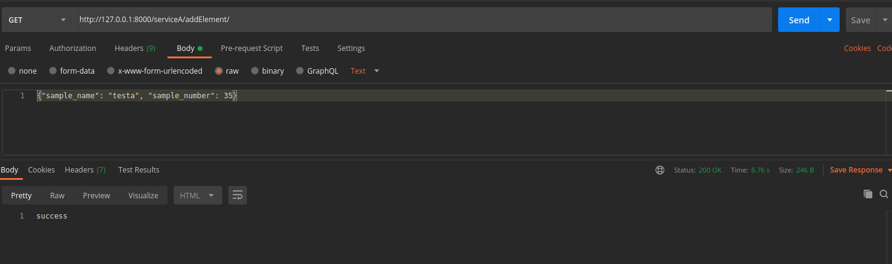
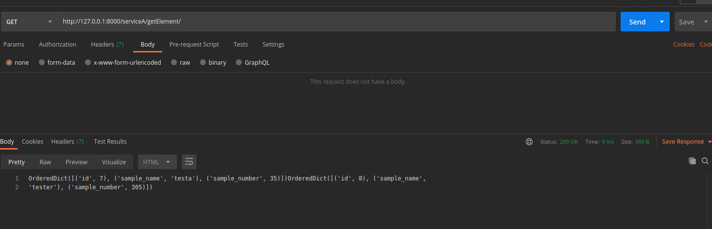
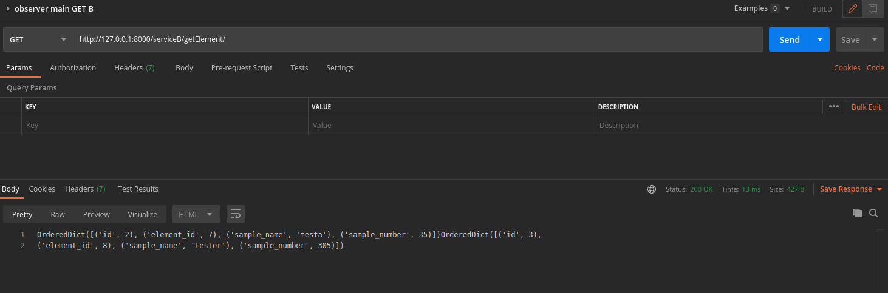
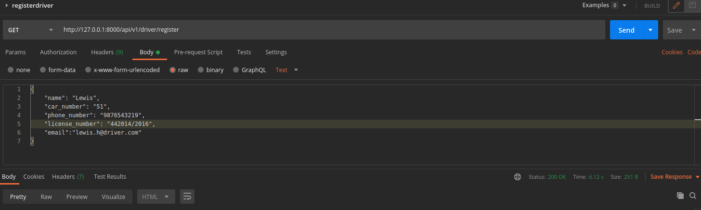
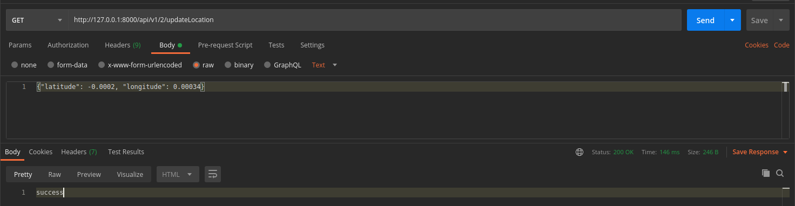
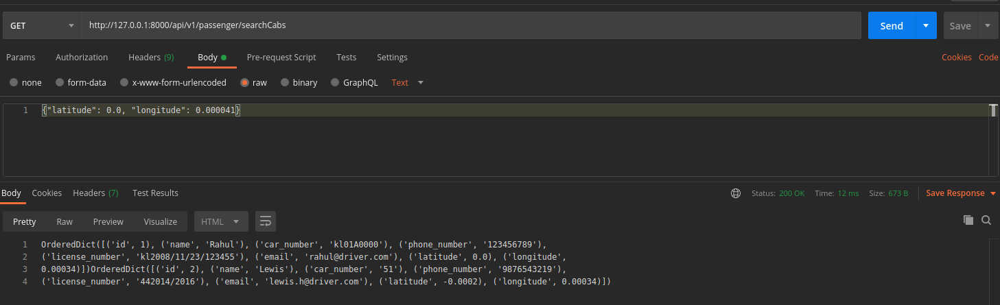

# Coding assignment for Atlantis
# Set 2
## Assignment 2
### Django services setup with observer pattern

applications:
- serviceA \
models: ElementA 

   

- serviceB \
models: ElementB

###api endpoint:

1) API to add data in serviceA
   

     endpoint: serviceA/addElement/
     data: "{
            "sample_name": "tester", "sample_number": 35
            }"

2) API to list all data in serviceA

    endpoint: serviceA/getElement/

2) API to list all data in serviceB

    endpoint: serviceB/getElement/

Note: observer pattern established with django signals \
pre_delete connection is also setup, such that at the event of deletion of ElementA, respective ElementB will be removed.

Api to edit ElementA are also setup in serviceA

    edit/update endpoint: serviceB/getElement/
   

## Assignment 3
### Cab Availability Facility

application:
- cab_service

models:
- Driver 
    - name
    - car_number
    - phone_number
    - license_number
    - email
    - latitude
    - longitude

API endpoints:

1) API for registering a new driver

    endpoint: api/v1/driver/register
    data: "{
            "name": "Lewis",
            "car_number": "51",
            "phone_number": "9876543219",
            "license_number": "442014/2016",
            "email":"lewis.h@driver.com"
            }"

2) API for updating driver location

     endpoint: api/v1/1/updateLocation
     data: "{"latitude": 0.0, "longitude": 0.00034}"

3) API for fetching nearby drivers, with passenger's coordinates as reference

     endpoint: api/v1/1/updateLocation
     data: "{"latitude": -2.004, "longitude": 0.00034}"

##Notes:

Data expected to be sent as a json string, for all calls requiring input